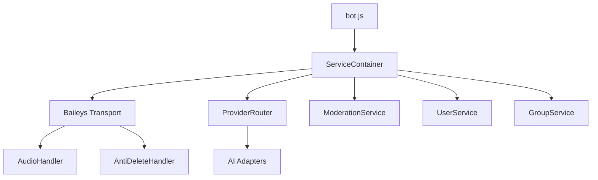

# Architecture HIVE-MIND

Ce document décrit l'architecture technique du bot WhatsApp HIVE-MIND après les refactorisations de Janvier 2026.

## Vue d'Ensemble

HIVE-MIND suit une architecture **Event-Driven** (pilotée par les événements) avec un **Conteneur d'Injection de Dépendances (DI)** pour gérer le cycle de vie des services.

## Composants Principaux

### 1. Point d'Entrée (`bot.js`)
- Initialise le verrouillage PID (`utils/pidLock.js`) pour empêcher les instances multiples.
- Initialise le `ServiceContainer`.
- Configure les handlers d'arrêt propre (SIGINT, SIGTERM) pour synchroniser les buffers Redis vers Supabase.

### 2. Service Container (`core/ServiceContainer.js`)
- Centralise l'instanciation de tous les services.
- Résout les dépendances circulaires.
- Supporte un mode `cli` partiel pour les outils d'administration.

### 3. Transport WhatsApp (`core/transport/baileys.js`)
Le transport a été modularisé pour réduire sa complexité :
- **AudioHandler** (`core/transport/handlers/audioHandler.js`) : Gère la transcription STT et le mode Audio Natif (Gemini Live).
- **AntiDeleteHandler** (`core/transport/handlers/antiDeleteHandler.js`) : Gère l'enregistrement et la restauration des messages supprimés.

### 4. Services Core
- **ModerationService** (`services/moderationService.js`) : Logique unifiée pour le ban, kick, mute et les avertissements.
- **GroupService** (`services/groupService.js`) : Gestion des métadonnées de groupe, source de vérité en Supabase, cache en Redis.
- **UserService** (`services/userService.js`) : Gestion des profils utilisateurs et linking d'identité (JID/LID).

### 5. Intelligence Artificielle
- **ProviderRouter** (`providers/index.js`) : Route les requêtes vers le meilleur modèle IA.
- **KeyResolver** (`config/keyResolver.js`) : Centralise la résolution des clés API depuis `.env`.
- **Adapters** (`providers/adapters/`) : Adaptateurs standardisés pour Gemini, OpenAI, Groq, Kimi, etc.

## Flux de Données

1. **Réception** : `baileys.js` reçoit un message.
2. **Prétraitement** : `AudioHandler` transcrit si nécessaire.
3. **Persistance** : `AntiDeleteHandler` stocke le message en cache.
4. **Routage** : L'événement `MESSAGE_RECEIVED` est publié sur l' `eventBus`.
5. **Traitement IA** : Le Core appelle le `ProviderRouter`.
6. **Action** : Si l'IA demande un outil, le `PluginLoader` exécute la fonction correspondante (ex: `gm_ban_user` via `ModerationService`).
