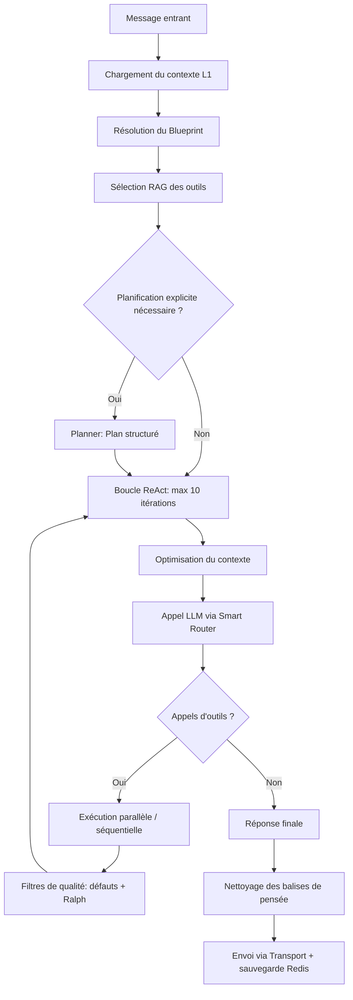

# Orchestrateur Central & Boucle ReAct — Comment l'agent pense et agit

## Raisonnement de classification Diátaxis

Le lecteur cherche à comprendre comment un message utilisateur traverse le système jusqu'à produire une réponse : le cycle de vie de l'agent, le rôle de l'injection de dépendances et le mécanisme d'équité entre utilisateurs. Il s'agit d'une **Explanation** conceptuelle.

---

## Context

La plupart des chatbots basiques traitent les messages dans un simple pipeline linéaire : message entrant → appel LLM → réponse sortante. Cette approche est insuffisante pour un agent autonome devant exécuter des séquences d'actions de plusieurs dizaines d'étapes, gérer des budgets de tokens, détecter ses propres erreurs et maintenir l'équité entre plusieurs utilisateurs simultanés.

HIVE-MIND résout ce problème via trois composants complémentaires :
1. La **boucle ReAct** (Reasoning and Acting) dans `BotCore` pour la réflexion itérative.
2. Le **`ServiceContainer`** pour l'injection de dépendances et le cycle de vie des services.
3. La **`FairnessQueue`** pour la répartition équitable des ressources entre utilisateurs.

---

## How it works

### 1. Cycle de vie de la Boucle ReAct

Le traitement complet d'un message est géré dans [src/core/index.ts](file:///home/omni/Code/HIVE-MIND-RAILWAY/src/core/index.ts). La boucle est limitée à **10 itérations maximum** pour prévenir les boucles infinies.



#### Phase 1 — Chargement du contexte et préparation

- **`tieredContextLoader.load()`** : Agrège le contexte L1 depuis Redis (passeport utilisateur, scratchpad, historique d'actions, messages récents).
- **Résolution du blueprint** : Le `BlueprintManager` charge le profil de comportement actif (ex. `hive_main`) depuis [src/core/blueprint/AgentBlueprint.ts](file:///home/omni/Code/HIVE-MIND-RAILWAY/src/core/blueprint/AgentBlueprint.ts). Ce profil définit les outils autorisés (`action_space.allowed_tools`), les budgets d'itérations et les contraintes de sécurité.
- **Sélection sémantique des outils (RAG)** : `pluginLoader.getRelevantTools()` interroge Supabase via l'appel RPC `match_tools` pour ne retourner que les outils dont les embeddings sont les plus proches sémantiquement de la requête. Les outils système (`edit_file`, `read_file`, `grep_search`, etc.) sont systématiquement ajoutés.
- **Filtrage Sentinel** : La liste d'outils est ensuite filtrée par `runtime.sentinel.projectActionSpace()` pour ne conserver que ceux autorisés par le blueprint actif.
- **Injection PTC** : Si le Programmatic Tool Calling est activé, le méta-outil `code_execution` est ajouté. Sa description docstring contient dynamiquement la liste des outils RAG sélectionnés, permettant au LLM de les orchestrer via un script JavaScript.

#### Phase 2 — Planification optionnelle

Pour les requêtes multi-étapes complexes, le `Planner` ([src/services/agentic/Planner.ts](file:///home/omni/Code/HIVE-MIND-RAILWAY/src/services/agentic/Planner.ts)) décompose la tâche en sous-étapes et les exécute séquentiellement. Si le taux de réussite des étapes tombe sous 50 %, une réponse d'excuse factuelle est générée sans exécuter la boucle ReAct standard.

#### Phase 3 — Boucle d'inférence itérative

À chaque itération :

1. **Optimisation de la fenêtre de contexte** : L'historique est compressé (`_compactHistory`) par un modèle LLM rapide ou tronqué mécaniquement (`_optimizeHistory`) pour respecter les limites de tokens.
2. **Appel LLM** : `providerRouter.chat()` invoque le Smart Router (voir doc 03).
3. **Détection d'hallucinations de format** : `extractToolCallsFromText()` intercepte les appels d'outils écrits en texte brut par le LLM et les convertit au format natif.
4. **Exécution des outils** :
   - Les outils en **lecture seule** (`read_file`, `list_directory`, `grep_search`) sont exécutés en parallèle via `Promise.all`.
   - Les outils **modificateurs d'état** (`edit_file`, `execute_bash_command`) sont exécutés séquentiellement.
   - `validateToolArgs()` vérifie les paramètres requis. En cas d'erreur, une correction guidée est demandée au LLM (max 2 essais).
   - `_safeExecuteTool()` applique les filtres Sentinel et journalise l'action dans Supabase.
   - **Dual Rendering** : Sur le canal CLI/TUI, les retours `userOutput` intermédiaires sont émis immédiatement (réduction de la latence perçue), tandis que les retours `llmOutput` (souvent tronqués) sont réinjectés dans l'historique.
5. **Contrôles de qualité** :
   - `detectResponseDefects()` : intercepte les anomalies de format (JSON brut, noms d'outils dans le texte, absence de `<thought>`).
   - **Ralph** : Vérifie si la réponse est complète. En cas de paresse détectée (stubs, TODOs, code non implémenté), un message de relance (*kickback*) est injecté et force une nouvelle itération.
   - **CoT Check** : Si la réponse ne contient que des pensées sans texte ni outils, une relance est déclenchée.

#### Phase 4 — Finalisation et envoi

- Les balises de pensée (`<think>`, `<thought>`, `<thinking>`) et structures XML malformées sont purgées de la réponse finale.
- Si la réponse est le token silencieux `__HIVE_SILENT_7f3a__`, aucun message n'est transmis.
- Le message est découpé en blocs de 1500 caractères et transmis via `transport.sendUniversalResponse()`.
- La trace d'actions compressée est enregistrée dans Redis pour alimenter l'historique du tour suivant.

---

### 2. Le `ServiceContainer` et l'injection de dépendances

Le `ServiceContainer` ([src/core/ServiceContainer.ts](file:///home/omni/Code/HIVE-MIND-RAILWAY/src/core/ServiceContainer.ts)) est le registre central de tous les services. Il résout les dépendances dans un **ordre topologique** défini à l'initialisation :

| Étape | Services instanciés |
|:------|:--------------------|
| 1 — Base | Logger, Supabase, Redis, `adminService`, `userService`, `agentMemory` |
| 2 — Mémoire | `actionMemory`, `groupService`, `workingMemory`, `consciousness`, `moderationService` |
| 3 — Embeddings | `EmbeddingsService` (modèle + dimensions configurables) |
| 4 — Voix/STT | `quotaManager`, `voiceProvider`, `MinimaxVoiceService`, `GroqTranscriptionService` |
| 5 — Mémoire sémantique | `SemanticMemory`, `graphMemory`, `knowledgeWeaver`, `consolidationService` |
| 6 — Runtime | `dream`, `AIRuntimeInfrastructure`, `ContextWindowService` |
| 7 — Routage | `browser`, `providerRouter` + adaptateurs IA |

**Mécanisme de liaison réciproque** : Si un service enregistré possède une méthode `setContainer()`, le conteneur y injecte automatiquement sa propre référence lors de l'enregistrement. Cela permet à un service d'interroger le conteneur pour résoudre des dépendances tardives sans couplage fort à la construction.

---

### 3. La `FairnessQueue` et l'équité multi-utilisateurs

Dans un contexte multi-canal, une simple file FIFO permettrait à un utilisateur émettant un burst de messages de bloquer tous les autres. La `FairnessQueue` ([src/core/FairnessQueue.ts](file:///home/omni/Code/HIVE-MIND-RAILWAY/src/core/FairnessQueue.ts)) résout ce problème par un **algorithme Round-Robin circulaire par `chatId`**.

```
Exemple avec 3 chats actifs (A, B, C) :
Queue A : [msg1, msg2]
Queue B : [msg3]
Queue C : [msg4, msg5, msg6]

Ordre d'extraction : msg1(A) → msg3(B) → msg4(C) → msg2(A) → msg5(C) → msg6(C)
```

**Insertion (`enqueue`)** :
- Si le `chatId` est nouveau, une file dédiée est créée et le chat est ajouté à la rotation.
- Si `isPremium` (message privé ou commande administrateur), l'événement est inséré en tête de file (`unshift`) et le pointeur `currentIndex` est immédiatement forcé sur ce chat.

**Extraction (`dequeue`)** :
- Le gestionnaire parcourt le tableau circulaire depuis `currentIndex`.
- Si la file du chat courant est vide, il est retiré de la rotation et le suivant est évalué.
- Après extraction d'un message, si la file locale est encore peuplée, `currentIndex` avance vers le chat suivant (modulo).

**L'orchestrateur** ([src/core/orchestrator.ts](file:///home/omni/Code/HIVE-MIND-RAILWAY/src/core/orchestrator.ts)) limite l'exécution simultanée à **3 tâches** (`maxConcurrent`) et impose un cooldown minimal entre deux réponses successives (`cooldown_between_responses_ms`) pour protéger contre le backlog.

---

## Why it is this way

- **Boucle unifiée** : Centraliser toute la logique de réflexion dans `BotCore` évite la duplication de pipelines distincts et garantit que tous les messages (simples ou complexes) bénéficient des mêmes filtres de sécurité, de qualité et anti-paresse.
- **IoC via `ServiceContainer`** : Le conteneur IoC facilite les tests unitaires (injection de mocks), évite les variables globales et rend explicite l'arbre de dépendances de l'application.
- **FairnessQueue** : La granularité au niveau `chatId` garantit un temps de réponse équitable même si un utilisateur envoie des rafales de requêtes longues.
- **Limitation à 10 itérations** : Un invariant dur sur le nombre maximum d'itérations empêche toute boucle infinie causée par un comportement aberrant du LLM.

---

## Alternatives and tradeoffs

| Approche | Forces | Compromis |
|:---------|:-------|:----------|
| **FairnessQueue Round-Robin (choisi)** | Isolation des canaux, équité garantie | Complexité de gestion des index circulaires |
| **File FIFO linéaire** | Implémentation triviale | Susceptible aux DoS involontaires par burst |
| **Priorité par rôle uniquement** | Simple, favorise les admins | Pénalise les utilisateurs standard même pour des requêtes légères |
| **File d'attente globale distribuée (Redis)** | Scalabilité multi-instances | Complexité opérationnelle élevée, overhead réseau |

---

## Further reading

- [src/core/index.ts](file:///home/omni/Code/HIVE-MIND-RAILWAY/src/core/index.ts) — Implémentation complète de la boucle ReAct
- [src/core/ServiceContainer.ts](file:///home/omni/Code/HIVE-MIND-RAILWAY/src/core/ServiceContainer.ts) — Conteneur IoC
- [src/core/FairnessQueue.ts](file:///home/omni/Code/HIVE-MIND-RAILWAY/src/core/FairnessQueue.ts) — Algorithme Round-Robin
- [src/core/orchestrator.ts](file:///home/omni/Code/HIVE-MIND-RAILWAY/src/core/orchestrator.ts) — Limite de concurrence et cooldown
- [src/services/agentic/Planner.ts](file:///home/omni/Code/HIVE-MIND-RAILWAY/src/services/agentic/Planner.ts) — Planificateur explicite
