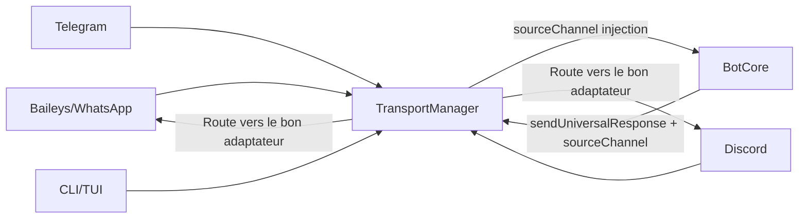
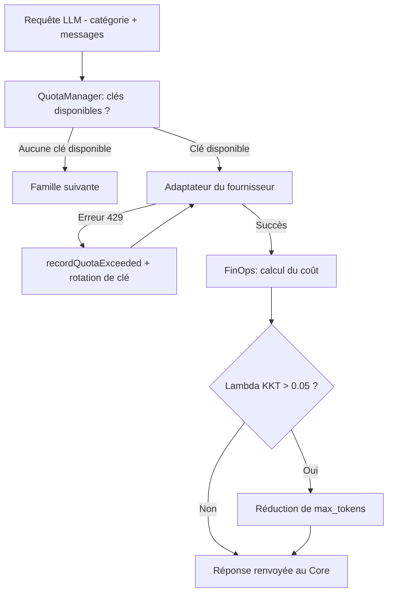

# Couche Transport & Smart Router — Normalisation et résilience IA

## Raisonnement de classification Diátaxis

Le lecteur cherche à comprendre comment HIVE-MIND communique avec plusieurs réseaux de messagerie sans dupliquer sa logique, et comment il évite les pannes de quota d'API de manière transparente. Il s'agit d'une **Explanation** : le « pourquoi » de la normalisation des transports et du routage multi-fournisseur.

---

## Context

Deux défis majeurs se posent à tout agent multi-canal :

1. **La diversité des protocoles** : WhatsApp (Baileys), Discord, Telegram et CLI ont chacun leurs propres API, structures de données et gestions des médias. Sans abstraction, tout changement de protocole impacte l'ensemble de la logique métier.
2. **La fiabilité des APIs LLM** : Les fournisseurs d'IA (Gemini, Groq, Anthropic, OpenRouter) imposent des limites de quota (RPM, TPM, RPD). Un système qui dépend d'un seul fournisseur s'arrête lors d'une panne ou d'un dépassement de quota.

HIVE-MIND résout ces deux problèmes avec deux composants complémentaires :
- Le **`TransportManager`** et son interface `TransportInterface` pour la normalisation des canaux.
- Le **`ProviderRouter`** (Smart Router) pour la rotation des clés et la cascade de modèles IA.

---

## How it works

### 1. Normalisation des transports

#### Le contrat `TransportInterface`

Le fichier [src/core/transport/interface.ts](file:///home/omni/Code/HIVE-MIND-RAILWAY/src/core/transport/interface.ts) définit le contrat minimal que tout adaptateur de transport doit respecter :

```typescript
interface TransportInterface {
  connect(): Promise<void>;
  disconnect(): Promise<void>;
  sendText(chatId: string, text: string, options?: SendOptions): Promise<void>;
  sendMedia(chatId: string, buffer: Buffer, mimeType: string, options?: SendOptions): Promise<void>;
  sendVoiceNote(chatId: string, buffer: Buffer, options?: SendOptions): Promise<void>;
  sendUniversalResponse(chatId: string, response: UniversalResponse, options?: SendOptions): Promise<void>;
  onMessage(callback: (msg: NormalizedMessage) => Promise<void>): void;
  downloadMedia(msg: NormalizedMessage): Promise<Buffer | null>;
  isAdmin(chatId: string, userId: string): Promise<boolean>;
  setPresence(chatId: string, presence: 'typing' | 'paused'): Promise<void>;
}
```

`sendUniversalResponse()` est la méthode clé : elle reçoit un objet `{ markdown, plainText, visual, data }` et chaque adaptateur est responsable de sa traduction selon les capacités du canal (WhatsApp ne supporte pas le Markdown riche, Discord gère les embeds, etc.).

La fonction `validateTransport()` vérifie dynamiquement à l'enregistrement que toutes ces méthodes sont implémentées, garantissant l'intégrité du contrat.

#### Le `TransportManager`

Le `TransportManager` ([src/core/transport/TransportManager.ts](file:///home/omni/Code/HIVE-MIND-RAILWAY/src/core/transport/TransportManager.ts)) orchestre tous les transports actifs :



Mécanismes clés :
- **Routage par `sourceChannel`** : À la réception d'un message, l'attribut `sourceChannel` (ex. `'whatsapp'`, `'discord'`) est injecté dans le `NormalizedMessage`. À l'envoi, si `sourceChannel` est fourni ou vaut `'current'`, le gestionnaire route vers le transport d'origine.
- **Transports simulés** : Les canaux `'internal'` et `'system'` interceptent les pulsations autonomes et les tâches internes sans générer d'appels réseau externes.
- **Chargement dynamique TUI** : Si le processus tourne en mode TTY, `HiveTransport` (adaptateur CLI/Ink) est chargé dynamiquement et le serveur WebSocket `TuiServerTransport` ([src/core/transport/TuiServerTransport.ts](file:///home/omni/Code/HIVE-MIND-RAILWAY/src/core/transport/TuiServerTransport.ts)) est lancé pour communiquer avec l'interface Ink.

---

### 2. Le Smart Router (ProviderRouter)

Le `ProviderRouter` ([src/providers/index.ts](file:///home/omni/Code/HIVE-MIND-RAILWAY/src/providers/index.ts)) est le composant responsable du routage de toutes les requêtes LLM.



#### Résolution et rotation des clés API

Le `EnvResolver` ([src/services/envResolver.ts](file:///home/omni/Code/HIVE-MIND-RAILWAY/src/services/envResolver.ts)) détecte les clés numérotées dans l'environnement (ex. `GEMINI_KEY`, `GEMINI_KEY_1`, `GEMINI_KEY_2`... jusqu'à 7 clés par fournisseur).

**Évitement proactif des 429** : Avant chaque appel, `getAvailableKeyForModel()` interroge le `QuotaManager` ([src/services/quotaManager.ts](file:///home/omni/Code/HIVE-MIND-RAILWAY/src/services/quotaManager.ts)). Si toutes les clés d'un modèle ont dépassé les seuils de RPM (marge 20 %), TPM (marge 10 %) ou RPD (marge 5 %), le modèle est proactivement ignoré.

**Bascule réactive** : Si malgré tout une erreur 429 survient, le routeur :
1. Extrait le `Retry-After` suggéré par le fournisseur.
2. Appelle `quotaManager.recordQuotaExceeded()` pour bloquer la clé concernée.
3. Bascule sur la clé suivante via une boucle interne (`while attempt < maxKeyAttempts`).
4. Tout cela de manière transparente pour l'utilisateur.

#### Sélection et cascade de modèles

La configuration des cascades est définie dans [src/config/models_config.json](file:///home/omni/Code/HIVE-MIND-RAILWAY/src/config/models_config.json) :

```json
{
  "chat_recipes": {
    "AGENTIC": {
      "primary": "gemini-2.5-flash",
      "fallback": "groq/llama-3.3-70b-versatile",
      "fallback_2": "openrouter/anthropic/claude-3.5-sonnet"
    },
    "SAFETY_SENTINEL": {
      "primary": "gemini-2.0-flash-lite",
      "fallback": "groq/llama-3.1-8b-instant"
    }
  }
}
```

La résolution suit trois niveaux :
1. **Sticky Session** : Si un modèle ou une famille est forcé dans le contexte (ex. via `forcedModel`), le routeur se limite à ce choix.
2. **Disponibilité / Santé** : Les familles saines (sans cooldown actif) avec au moins une clé valide sont sélectionnées.
3. **Cascade primaire → fallback** : Les modèles sont tentés séquentiellement selon la recette configurée.

#### Protections de fiabilité

- **Circuit Breaker par famille** : Après des échecs répétés, une famille IA (ex. `groq`) entre en cooldown progressif (1 min → 5 min → 15 min max). Tout succès réinitialise le circuit.
- **Reliability Scoring par modèle** : Les pénalités s'accumulent sur les modèles subissant des erreurs fonctionnelles (parsing, timeout) et décroissent selon une demi-vie de 30 minutes. `_sortModelsByReliability()` classe les candidats en conséquence.
- **KKT Throttling** : Si le multiplicateur lagrangien $\lambda = (\text{coût\_session} / \text{budget\_max})^4 > 0.05$, le routeur réduit proportionnellement `max_tokens` : $\text{max\_tokens} \times (1 - \lambda)$. Si $\lambda > 0.8$, des directives d'urgence `<kkt_emergency>` sont injectées dans le prompt système via [src/core/context/TieredContextLoader.ts](file:///home/omni/Code/HIVE-MIND-RAILWAY/src/core/context/TieredContextLoader.ts).

---

## Why it is this way

- **`TransportInterface` uniforme** : Isoler l'agent du protocole de communication permet de remplacer une bibliothèque sous-jacente (ex. en cas de changement d'API WhatsApp) sans toucher à la logique métier.
- **Absence de classification LLM en entrée du router** : Une étape de classification sémantique par LLM introduirait 300 à 800 ms de latence et un surcoût de facturation à chaque requête. Les catégories explicites (`AGENTIC`, `CODING`, `REASONING`, `SAFETY_SENTINEL`) sont transmises directement par le code appelant.
- **Rotation de clés vs multi-instances** : Une seule instance Node.js partage son pool de clés et son état de quota. Des instances séparées ne pourraient pas coordonner l'utilisation des clés sans un service de coordination externe coûteux.
- **KKT Lagrangien** : L'exposant 4 dans la formule $\lambda$ crée une restriction non linéaire : l'agent est peu contraint jusqu'à ~70 % du budget, puis la restriction s'accélère rapidement pour éviter le dépassement brutal.

---

## Alternatives and tradeoffs

| Approche | Forces | Compromis |
|:---------|:-------|:----------|
| **TransportInterface + TransportManager (choisi)** | Découplage total, ajout de canal sans impact sur le core | Interface à maintenir pour chaque adaptateur |
| **Implémentation directe par canal** | Simplicité initiale | Duplication de code, modifications risquées |
| **Couplage direct à un seul LLM** | Latence minimale, débogage direct | Arrêt total en cas de panne fournisseur |
| **Smart Router en cascade (choisi)** | Continuité de service, multi-fournisseur | Variations possibles de qualité entre modèles |
| **Multi-instances par fournisseur** | Isolation complète par fournisseur | Synchronisation d'état Redis requise, coût opérationnel élevé |

---

## Further reading

- [src/core/transport/interface.ts](file:///home/omni/Code/HIVE-MIND-RAILWAY/src/core/transport/interface.ts) — Contrat `TransportInterface`
- [src/core/transport/TransportManager.ts](file:///home/omni/Code/HIVE-MIND-RAILWAY/src/core/transport/TransportManager.ts) — Routage et normalisation des canaux
- [src/core/transport/TuiServerTransport.ts](file:///home/omni/Code/HIVE-MIND-RAILWAY/src/core/transport/TuiServerTransport.ts) — Serveur WebSocket pour la TUI
- [src/providers/index.ts](file:///home/omni/Code/HIVE-MIND-RAILWAY/src/providers/index.ts) — Smart Router (ProviderRouter)
- [src/services/quotaManager.ts](file:///home/omni/Code/HIVE-MIND-RAILWAY/src/services/quotaManager.ts) — Gestion des quotas de clés API
- [src/services/envResolver.ts](file:///home/omni/Code/HIVE-MIND-RAILWAY/src/services/envResolver.ts) — Résolution des clés numérotées
