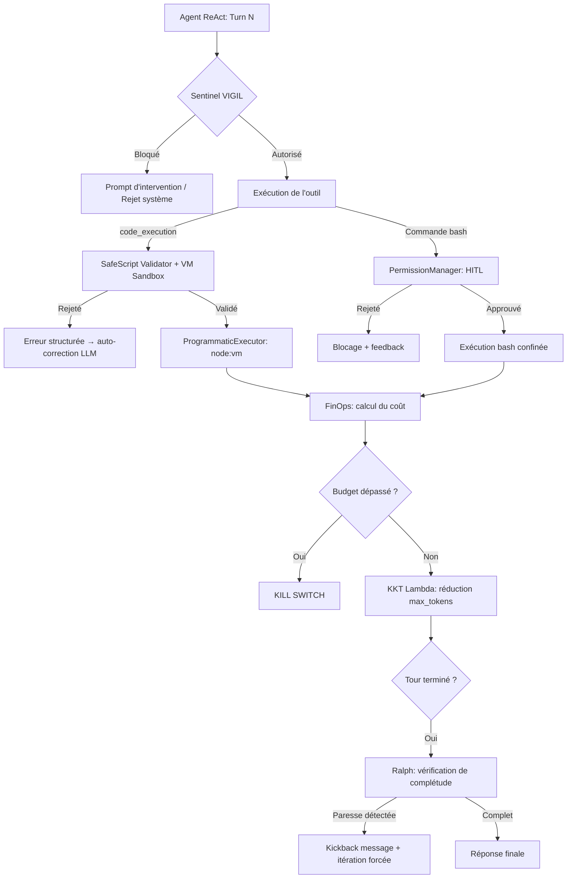

# Sécurité, PTC & Supervision Runtime — Comment l'agent est contrôlé

## Raisonnement de classification Diátaxis

Le lecteur cherche à comprendre les mécanismes de contrôle qui encadrent les actions de l'agent autonome : validation des scripts générés, supervision des permissions, détection de paresse et gestion budgétaire. Il s'agit d'une **Explanation** répondant au « pourquoi ces garde-fous existent et comment ils fonctionnent ensemble ».

---

## Context

Dans les architectures d'agents autonomes pilotés par des LLM, deux risques majeurs apparaissent :

1. **Actions destructrices ou non autorisées** : Un LLM peut générer du code JavaScript ou des commandes système qui accèdent à des ressources hors sandbox, escaladent des privilèges ou exfiltrent des données.
2. **Dérive budgétaire ou inefficacité** : L'agent peut boucler indéfiniment, remettre du travail à l'utilisateur (stubs, TODOs) ou épuiser le budget de tokens/finances d'une session sans produire de résultat utile.

HIVE-MIND introduit un **plan de contrôle fermé à trois piliers** qui valide, supervise et régule chaque action de l'agent en continu, sans nécessiter d'intervention humaine pour chaque action standard.

---

## How it works

Les trois piliers agissent à des étapes différentes du cycle de réflexion :

---

### Pilier 1 — Validation des scripts (PTC) et confinement

Le Programmatic Tool Calling (PTC) permet au LLM de générer un script JavaScript orchestrant plusieurs outils en un seul tour, réduisant les allers-retours de contexte.

#### Validation AST par `SafeScriptValidator`

Avant toute exécution, le script est analysé par [src/services/ptc/SafeScriptValidator.ts](file:///home/omni/Code/HIVE-MIND-RAILWAY/src/services/ptc/SafeScriptValidator.ts) :

1. **Analyse syntaxique via Acorn** : Le code est parsé avec `acorn.parse`. En cas d'échec, `autoRepairCode` tente de corriger les erreurs syntaxiques communes générées par les LLM :
   - Fermeture automatique des parenthèses/accolades non fermées.
   - Ajout de points-virgules manquants.
   - Fermeture des chaînes de caractères et template literals.
   - Ajout du mot-clé `await` manquant devant les appels d'outils.

2. **Analyse de portée** : Un parcours AST via `acorn-walk` collecte toutes les variables déclarées et les compare aux identifiants utilisés. Les erreurs possibles :
   - `UNDEFINED_VAR` : variable utilisée sans déclaration.
   - `UNKNOWN_TOOL` : outil non disponible dans l'espace d'actions (avec suggestion du plus proche via distance de Levenshtein).

3. **Contrôle de sécurité statique** : Les constructions dangereuses provoquent un rejet immédiat `UNSAFE_CONSTRUCT` :
   - `eval`, `Function`, `require`, `import`, `process`, `globalThis`
   - Accès aux propriétés de prototype : `__proto__`, `constructor`

4. **Avertissements non bloquants** :
   - Boucles potentiellement infinies (`while(true)`, `for(;;)`).
   - Absence de clause `return`.
   - Moins de 2 appels d'outils (PTC peu utile, le Tool Calling natif serait plus adapté).

#### Exécution dans le bac à sable `node:vm`

Le `ProgrammaticExecutor` ([src/services/ptc/ProgrammaticExecutor.ts](file:///home/omni/Code/HIVE-MIND-RAILWAY/src/services/ptc/ProgrammaticExecutor.ts)) exécute le code validé :

- **Isolation** : Le code est enveloppé dans une IIFE asynchrone et exécuté dans un contexte `node:vm` isolé. Un timeout matériel (30 secondes par défaut) garantit l'interruption des boucles infinies non détectées.
- **Helpers sécurisés** : [src/services/ptc/SandboxHelpers.ts](file:///home/omni/Code/HIVE-MIND-RAILWAY/src/services/ptc/SandboxHelpers.ts) expose des utilitaires défensifs (`toArray`, `safeGet`, `extractText`) pour traiter les structures retournées par les outils sans crash.
- **Scope Guard (Proxy)** : Le contexte global est encapsulé dans un Proxy JavaScript. Tout accès à une propriété non injectée lève une `ReferenceError` explicite au lieu de retourner `undefined` silencieusement, empêchant les dérives comportementales liées aux fautes de frappe.

#### Tâches longues — `WakeSystem`

Pour les tâches dépassant le timeout LLM de 90 secondes, [src/services/ptc/WakeSystem.ts](file:///home/omni/Code/HIVE-MIND-RAILWAY/src/services/ptc/WakeSystem.ts) permet au script d'appeler `HIVE.sleepAndWake(delayMs, wakePrompt)`. L'événement de réveil est persisté dans Redis (`hive:wake_events`) et la VM se termine immédiatement. Un démon heartbeat (toutes les 5 secondes) extrait les événements expirés et réinjecte un prompt de réveil dans le cycle de l'agent.

---

### Pilier 2 — Validation des permissions (PermissionManager + HITL)

Le `PermissionManager` ([src/core/security/PermissionManager.ts](file:///home/omni/Code/HIVE-MIND-RAILWAY/src/core/security/PermissionManager.ts)) intercepte les actions nécessitant une validation humaine (Human-In-The-Loop).

#### Restrictions systématiques

- **Commandes interdites** : `su`, `sudo` sont bloquées inconditionnellement (`BANNED_COMMANDS`).
- **Exécution inline** : `node -e`, `python -c`, `bash -c` sont bloquées (`BANNED_FLAG_PATTERNS`) pour empêcher l'exécution de code hors sandbox.
- **Confinement des écritures** : Toute écriture de fichier (`validateFileWrite`) est limitée aux répertoires autorisés : `Sandbox1/` et `storage_hm/`. Les tentatives vers d'autres chemins sont rejetées avec un message indiquant les répertoires autorisés.

#### Système HITL à double logique (ou triple)

Lorsqu'une action sort du périmètre de la liste blanche, le gestionnaire demande une validation humaine selon la logique suivante :

| Logique | Déclencheur | Canal de validation | Timeout |
|:--------|:------------|:--------------------|:--------|
| **0 — Local** | Session CLI/TUI | Terminal ou TUI directement | - |
| **1 — Admin Hub** | Canal admin configuré (`SECURITY_HUB_ID`) | Channel dédié (WhatsApp/Discord/Telegram) | 10 min → bascule vers L2 |
| **2 — In-Band / DM** | SuperAdmin ou fallback | Canal courant ou DM au propriétaire | 10 min → rejet par défaut |

Les administrateurs approuvent via `.approve <ID>` ou rejettent via `.reject <ID> [feedback]`. Un rejet avec feedback injecte la correction directement dans l'historique de l'agent.

#### Sentinel VIGIL — Évaluation sémantique

Le `RuntimeSentinel` dans [src/services/runtime/RuntimeInfrastructure.ts](file:///home/omni/Code/HIVE-MIND-RAILWAY/src/services/runtime/RuntimeInfrastructure.ts) ajoute une couche d'évaluation sémantique au-dessus des règles statiques :

- **Pruning déterministe** : `projectActionSpace()` filtre l'espace d'actions selon le blueprint. Si `read_only_fs` est actif, tout outil d'écriture est bloqué directement.
- **Fast-paths (bypass)** : Les outils en lecture seule (`grep_search`, `read_file`, `browser_screenshot`, `update_scratchpad`) ne sont pas évalués par le LLM pour économiser la latence et les tokens.
- **Évaluation LLM dédiée** : Les actions non bypassées sont soumises au modèle `SAFETY_SENTINEL`. La sortie JSON est validée strictement.
- **Politique de défaillance** :
  - **FAIL CLOSED** : Les actions critiques (administration de groupes, suppressions de données) sont bloquées en cas d'erreur de traitement du Sentinel.
  - **FAIL OPEN** : Les actions standards sont autorisées avec un niveau de risque moyen si l'évaluation échoue, pour éviter les pannes d'infrastructure.

---

### Pilier 3 — Supervision de la complétude et FinOps

#### Ralph — Détection de la paresse agentique

La classe `RalphController` intercepte les réponses de l'agent en fin de boucle ReAct :

- **Critères de détection** : Code non implémenté (`// TODO`, `// implement here`), placeholders, délégation du travail à l'utilisateur, abandon prématuré d'une tâche multi-étapes.
- **Correction active (Kickback)** : Si la paresse est confirmée, la réponse incomplète est insérée dans l'historique, suivie d'une directive système stricte injectée comme message utilisateur. La boucle ReAct continue sans intervention de l'utilisateur final.

#### FinOps et Budget KKT Lagrangien

Les coûts sont calculés à partir de [src/config/pricing.json](file:///home/omni/Code/HIVE-MIND-RAILWAY/src/config/pricing.json) et enregistrés pour chaque appel réussi.

**Kill Switch** : Si le budget cumulé de session dépasse `maxSessionBudget` (défaut : $2.00), l'exception `BUDGET_EXCEEDED` est propagée via l'event bus et l'exécution s'arrête immédiatement.

**KKT Throttling** : Le multiplicateur lagrangien est calculé :
$$\lambda = \left(\frac{\text{coût session}}{\text{budget max}}\right)^4$$

- Si $\lambda > 0.05$ : le routeur réduit `max_tokens` proportionnellement : $\max(200, \lfloor \text{max\_tokens} \times (1 - \lambda) \rfloor)$.
- Si $\lambda > 0.8$ : les balises `<kkt_emergency>CRITICAL</kkt_emergency>` et `<kkt_directive>` sont injectées dans le prompt système via [src/core/context/TieredContextLoader.ts](file:///home/omni/Code/HIVE-MIND-RAILWAY/src/core/context/TieredContextLoader.ts), ordonnant à l'agent de clore la tâche immédiatement.

---

## Why it is this way

- **Validation AST** : Les LLM génèrent fréquemment du JavaScript syntaxiquement incorrect ou contenant des variables mal orthographiées. L'analyse statique avant exécution transforme ces erreurs silencieuses en rejets explicites avec messages correctifs.
- **node:vm plutôt que Docker** : La légèreté du bac à sable JS est préférée à l'isolation OS complète. Le démarrage d'un conteneur Docker prendrait plusieurs secondes ; `node:vm` prend quelques millisecondes. La sécurité est compensée par les contrôles statiques (AST) et le Proxy Scope Guard.
- **Ralph en boucle fermée** : Les LLM ont tendance à déléguer le travail de codage à l'utilisateur pour des tâches longues. Ralph force une itération supplémentaire sans intervention humaine, ce qui est transparent pour l'utilisateur final.
- **Exposant 4 dans KKT** : La non-linéarité garantit que l'agent dispose de toute sa capacité jusqu'à ~70 % du budget, puis la restriction s'accélère exponentiellement pour éviter le dépassement brutal.

---

## Alternatives and tradeoffs

| Approche | Forces | Compromis |
|:---------|:-------|:----------|
| **Sandbox VM + AST (choisi)** | Légèreté, millisecondes, détection précoce | Pas d'isolation OS complète |
| **Conteneurs Docker jetables** | Isolation réseau et OS totale | Démarrage lent (secondes), mémoire élevée |
| **Règles regex statiques uniquement** | Instantané, zéro coût d'API | Contournable, incapable d'analyse contextuelle |
| **Évaluation Sentinel LLM (choisi)** | Analyse sémantique de l'intention | Latence et tokens supplémentaires par action |
| **Budget fixe dur (kill switch seul)** | Simple | Coupure abrupte, pas de dégradation progressive |
| **KKT Lagrangien (choisi)** | Dégradation progressive et gracieuse | Formule mathématique à comprendre et calibrer |

---

## Further reading

- [src/services/ptc/SafeScriptValidator.ts](file:///home/omni/Code/HIVE-MIND-RAILWAY/src/services/ptc/SafeScriptValidator.ts) — Validation AST et auto-repair
- [src/services/ptc/ProgrammaticExecutor.ts](file:///home/omni/Code/HIVE-MIND-RAILWAY/src/services/ptc/ProgrammaticExecutor.ts) — Exécution sandbox VM
- [src/services/ptc/WakeSystem.ts](file:///home/omni/Code/HIVE-MIND-RAILWAY/src/services/ptc/WakeSystem.ts) — Tâches longues et réveil Redis
- [src/core/security/PermissionManager.ts](file:///home/omni/Code/HIVE-MIND-RAILWAY/src/core/security/PermissionManager.ts) — HITL et confinement
- [src/services/runtime/RuntimeInfrastructure.ts](file:///home/omni/Code/HIVE-MIND-RAILWAY/src/services/runtime/RuntimeInfrastructure.ts) — Sentinel VIGIL, Ralph, FinOps KKT
- [src/config/pricing.json](file:///home/omni/Code/HIVE-MIND-RAILWAY/src/config/pricing.json) — Coûts unitaires des modèles
