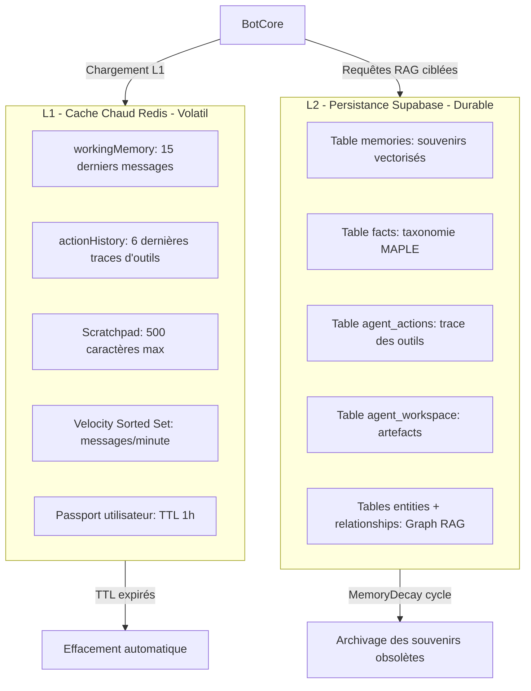
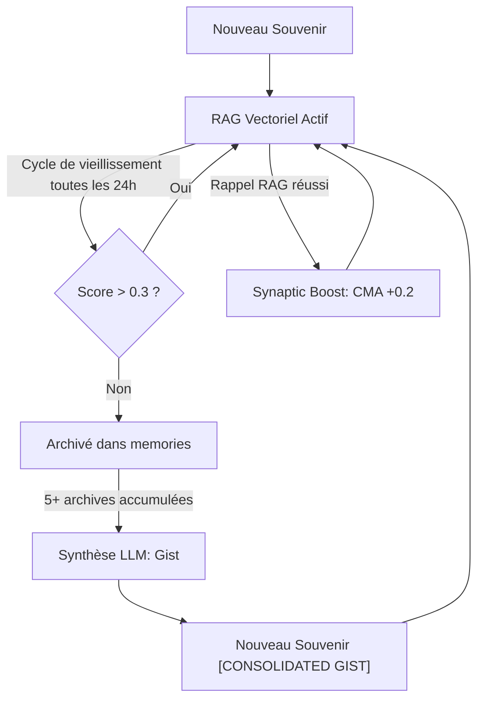

# Mémoire Cognitive & Bases de Données — Comment l'agent se souvient

## Raisonnement de classification Diátaxis

Le lecteur cherche à comprendre pourquoi et comment HIVE-MIND segmente sa mémoire en plusieurs niveaux, comment les souvenirs vieillissent et sont consolidés, et comment la recherche sémantique est organisée. Il s'agit d'une **Explanation** conceptuelle et architecturale.

---

## Context

Un agent autonome interagissant avec des utilisateurs à travers plusieurs canaux (WhatsApp, Discord, Telegram, CLI) fait face à quatre défis cognitifs :

1. **Saturation de la fenêtre de contexte** : Les LLM ont une limite de tokens. Injecter l'intégralité d'un historique de conversation produit le phénomène du *lost in the middle* et coûte cher en tokens.
2. **Bruit conversationnel** : Les salutations, anecdotes transitoires et messages sans valeur informationnelle ne doivent pas être conservés indéfiniment au même niveau que les faits structuraux sur l'utilisateur.
3. **Persistance multi-plateforme** : L'agent doit reconnaître un même utilisateur quel que soit le canal et conserver ses préférences et objectifs d'une session à l'autre.
4. **Résilience aux interruptions** : L'exécution de tâches longues et complexes doit survivre à des redémarrages ou des pannes temporaires.

HIVE-MIND répond à ces défis avec une architecture mnésique à deux niveaux de stockage (L1 cache chaud / L2 persistance), un cycle de vie biologique pour les souvenirs (déclin + consolidation) et une stratégie de récupération à la demande (*Pull*) plutôt qu'une injection systématique (*Push*).

---

## How it works

### 1. Architecture à deux niveaux (L1/L2)



#### Mémoire de travail L1 — Redis Cloud

Gérée par [src/services/workingMemory.ts](file:///home/omni/Code/HIVE-MIND-RAILWAY/src/services/workingMemory.ts) :

| Structure Redis | Contenu | Limite | TTL |
|:----------------|:--------|:-------|:----|
| `chat:{chatId}:context` (liste) | Messages récents | 15 entrées (`lTrim`) | 15 min |
| `action_history:{chatId}` (liste) | Traces d'outils | 6 entrées (`lTrim`) | 15 min |
| `scratchpad:{chatId}` (string) | Notes temporaires de l'agent | 500 caractères | 24h |
| `passport:{sender}` (hash) | Métadonnées utilisateur | - | 1h |
| `velocity:{chatId}` (sorted set) | Timestamps des messages | Nettoyage fenêtre 1 min | - |

Le **mode vélocité** : si plus de 10 messages arrivent en 1 minute (`velocity` > 10), l'agent passe en mode « chaos » et utilise des mentions et citations pour cibler ses réponses malgré le flux élevé.

**Résilience locale** : En cas d'indisponibilité de Redis Cloud, [src/services/redisClient.ts](file:///home/omni/Code/HIVE-MIND-RAILWAY/src/services/redisClient.ts) bascule automatiquement sur un `InMemoryRedisMock` qui simule les opérations Redis classiques. L'agent reste fonctionnel hors ligne.

#### Mémoire à long terme L2 — Supabase (PostgreSQL + pgvector)

Gérée par [src/services/supabase.ts](file:///home/omni/Code/HIVE-MIND-RAILWAY/src/services/supabase.ts) :

**Normalisation omni-canal** : Le schéma résout le problème des identités multiples : une table `users` centralise les profils, tandis que `user_identities` lie ces profils aux identifiants spécifiques de chaque canal (WhatsApp JID, Discord ID, etc.). `resolveUser()` et `resolveGroup()` convertissent les identifiants spécifiques en UUID de contexte unifiés. Les conflits de création simultanée sont gérés par `upsert` avec `onConflict`.

---

### 2. Taxonomie MAPLE — Apprentissage structuré de l'utilisateur

Le `LearningEngine` ([src/services/learning/LearningEngine.ts](file:///home/omni/Code/HIVE-MIND-RAILWAY/src/services/learning/LearningEngine.ts)) analyse en arrière-plan les 20 derniers messages pour extraire des insights structurés et les classer selon trois catégories :

| Préfixe | Sémantique | Exemple |
|:--------|:-----------|:--------|
| `fact:` | Attribut statique | `fact:stack_technique → TypeScript + Next.js` |
| `pref:` | Préférence comportementale | `pref:ton_reponse → concis et direct` |
| `goal:` | Objectif en cours | `goal:deploiement → migration Node.js LTS` |

Ces faits sont écrits dans la table Supabase `facts` et hydratés lors de la construction du prompt via un bloc XML `<user_model>` dans [src/core/context/TieredContextLoader.ts](file:///home/omni/Code/HIVE-MIND-RAILWAY/src/core/context/TieredContextLoader.ts) :

```xml
<user_model>
  <facts>
    <fact key="stack_technique">TypeScript + Next.js</fact>
  </facts>
  <preferences>
    <pref key="ton_reponse">concis et direct</pref>
  </preferences>
  <active_goals>
    <goal key="deploiement">migration Node.js LTS</goal>
  </active_goals>
</user_model>
```

---

### 3. Cycle de vie des souvenirs — Memory Decay & CMA

Le cycle de vie des souvenirs à long terme est régi par un modèle mathématique d'oubli défini dans [src/services/memory/MemoryDecay.ts](file:///home/omni/Code/HIVE-MIND-RAILWAY/src/services/memory/MemoryDecay.ts).

#### Calcul du score de déclin

$$\text{Score} = (\text{Récence} \times 0.4) + (\text{Fréquence} \times 0.3) + (\text{Importance} \times 0.3)$$

| Composante | Formule | Plage |
|:-----------|:--------|:------|
| **Récence** | $e^{-\text{ageHeures} / 24}$ | 0 → 1 (exponentiel décroissant) |
| **Fréquence** | $\min(\text{recall\_count} / 10, 1.0)$ | 0 → 1 |
| **Importance** | +0.2 par mot-clé stratégique détecté (regex) | 0 → 1 (plafonné) |

Mots-clés d'importance : *promis, engagement, rdv, deadline, important, préfère, déteste*, etc.

#### Archivage

Si le score tombe sous **0.3**, le souvenir est archivé (`archived_at` renseigné). Il est exclu des requêtes RAG standard mais reste accessible pour l'audit ou la consolidation.

#### Plasticité synaptique — CMA Boost

Lorsqu'un souvenir est rappelé avec succès lors d'une recherche RAG, la fonction SQL stockée `cma_boost_memory` ([src/supabase/migrations/20260519130000_cma_boost_memory.sql](file:///home/omni/Code/HIVE-MIND-RAILWAY/src/supabase/migrations/20260519130000_cma_boost_memory.sql)) est appelée asynchronement :
- Incrémente `recall_count` de 1.
- Augmente `decay_score` de 0.2 (plafonné à 1.0).

Ce mécanisme simule le renforcement synaptique biologique : un souvenir utilisé résiste à l'archivage.

#### Consolidation par Gist

Si 5 souvenirs ou plus sont archivés lors d'un cycle de déclin, un LLM synthétise leur contenu en une ou deux phrases denses. Cette synthèse est enregistrée comme nouveau souvenir actif sous l'étiquette `[CONSOLIDATED GIST]`. Les souvenirs détaillés restent archivés (réduction de volume sans perte d'information essentielle).



---

### 4. Recherche RAG à double portée (Hybrid RAG)

La recherche sémantique dans [src/services/memory.ts](file:///home/omni/Code/HIVE-MIND-RAILWAY/src/services/memory.ts) combine deux requêtes parallèles via la fonction SQL RPC `match_memories` :

| Portée | Filtre | Seuil de similarité cosinus |
|:-------|:-------|:----------------------------|
| **RAG Local** | `context_id` = discussion courante | ≥ 0.70 |
| **RAG Global** | `context_id` = `'global'` (connaissances partagées) | ≥ 0.65 |

Les résultats sont fusionnés, dédupliqués par ID et enrichis d'un indicateur d'ancienneté relative (*aujourd'hui, hier, il y a X semaines*).

En complément, [src/services/graphMemory.ts](file:///home/omni/Code/HIVE-MIND-RAILWAY/src/services/graphMemory.ts) gère un **Knowledge Graph** : les entités extraites (table `entities`) sont reliées par des arcs typés et pondérés (table `relationships`). La recherche via `match_entities` et l'exploration des voisins (`getNeighbors`) permettent d'interroger les relations structurelles entre concepts.

**Stratégie Pull** : Aucun contenu RAG sémantique n'est injecté automatiquement dans le prompt initial. L'agent doit explicitement utiliser les outils `search_long_term_memory` ou `db_document_read` pour extraire les informations pertinentes, ce qui maintient le prompt système compact et évite les hallucinations liées à du contexte non pertinent.

---

### 5. Nettoyage et compression de la mémoire de travail

En plus des TTL automatiques de Redis, deux mécanismes actifs complètent le nettoyage :

**Fenêtre glissante** : `lTrim` est appelé à chaque ajout dans les listes Redis pour maintenir les limites fixes (15 messages, 6 traces d'actions).

**Summarize Supabase** : Quand la table `memories` dépasse 50 entrées pour une discussion (`keepLast = 50`), la méthode `summarize()` de `semanticMemory` :
1. Récupère les 100 entrées les plus anciennes.
2. Un LLM en extrait une liste de faits clés à la troisième personne.
3. Ces faits sont enregistrés dans `facts` (clé `résumé_YYYY-MM-DD`).
4. Les anciens messages sont supprimés de la table `memories`.

---

## Why it is this way

- **Architecture Pull (à la demande)** : Un prompt système compact (moins de 1000 tokens) hydraté uniquement avec les données L1 nécessaires permet à l'agent d'économiser significativement les tokens. Le RAG à la demande évite l'injection de contexte non pertinent qui génère des hallucinations.
- **Déclin mathématique vs suppression brutale** : La formule pondérée préserve les faits critiques (préférences permanentes, objectifs actifs) au lieu de les effacer aveuglément après une durée fixe. Un utilisateur n'a pas à répéter ses préférences à chaque session.
- **Résilience Redis → mock** : En mode développement ou lors de pannes temporaires, l'agent reste fonctionnel grâce au mock en mémoire. Cela évite des crashs au démarrage en environnement de test.
- **Séparation `user_identities`** : La normalisation omni-canal dans le schéma Supabase garantit qu'un même utilisateur est reconnu quel que soit le canal de messagerie utilisé, sans dupliquer les données de profil.

---

## Alternatives and tradeoffs

| Approche | Forces | Compromis |
|:---------|:-------|:----------|
| **Redis L1 + Supabase L2 (choisi)** | Faible latence pour le cache chaud, persistance longue durée | Deux systèmes à maintenir |
| **PostgreSQL seul** | Gestion transactionnelle unifiée | Latence élevée pour les lectures fréquentes de contexte |
| **Injection Push de tout le contexte** | Simple à implémenter | Surcoût de tokens massif, hallucinations liées au *lost in the middle* |
| **Déclin temporel uniquement (DELETE après X jours)** | Simple | Destruction aveugle de faits critiques |
| **RAG hybride local + global (choisi)** | Contexte combiné, précision améliorée | Double génération d'embeddings, deux requêtes par appel |
| **RAG vectoriel pur** | Implémentation unique | Perd les relations structurelles entre entités (Graph RAG) |

---

## Further reading

- [src/services/workingMemory.ts](file:///home/omni/Code/HIVE-MIND-RAILWAY/src/services/workingMemory.ts) — Mémoire de travail Redis L1
- [src/services/memory/MemoryDecay.ts](file:///home/omni/Code/HIVE-MIND-RAILWAY/src/services/memory/MemoryDecay.ts) — Algorithme et formules de déclin mnésique
- [src/services/learning/LearningEngine.ts](file:///home/omni/Code/HIVE-MIND-RAILWAY/src/services/learning/LearningEngine.ts) — Taxonomie MAPLE et extraction de faits
- [src/services/memory.ts](file:///home/omni/Code/HIVE-MIND-RAILWAY/src/services/memory.ts) — SemanticMemory, factsMemory, workspaceMemory
- [src/services/graphMemory.ts](file:///home/omni/Code/HIVE-MIND-RAILWAY/src/services/graphMemory.ts) — Knowledge Graph (entités + relations)
- [src/services/redisClient.ts](file:///home/omni/Code/HIVE-MIND-RAILWAY/src/services/redisClient.ts) — Client Redis avec fallback mock
- [src/supabase/migrations/20260519130000_cma_boost_memory.sql](file:///home/omni/Code/HIVE-MIND-RAILWAY/src/supabase/migrations/20260519130000_cma_boost_memory.sql) — Boost synaptique CMA
