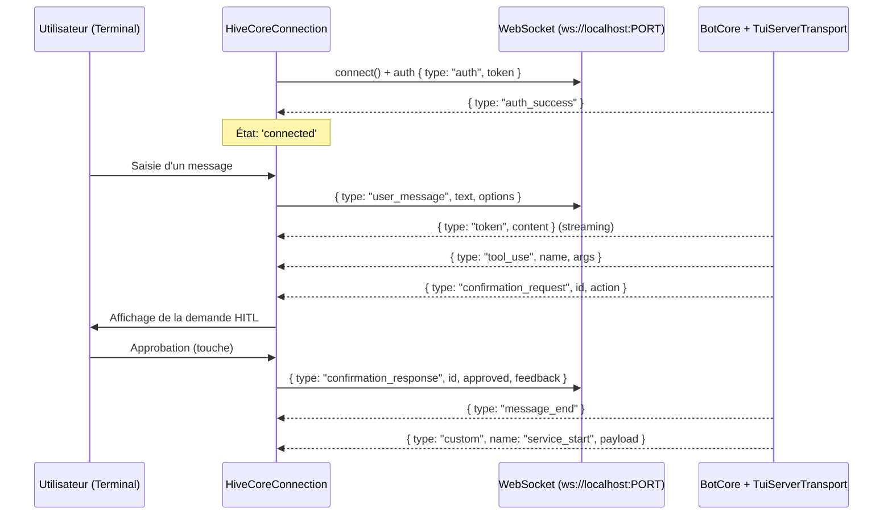
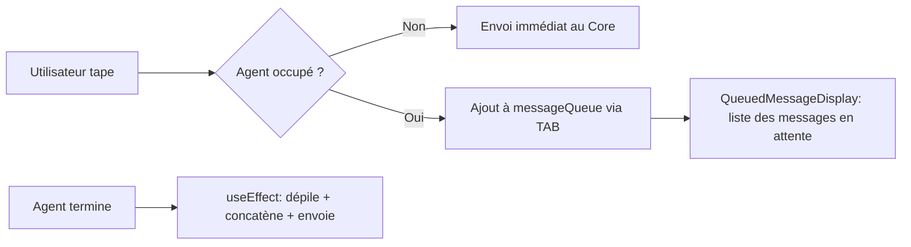
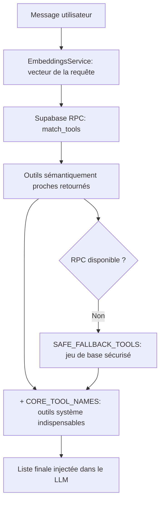

# TUI & Système de Plugins — Comment l'interface communique avec le Core

## Raisonnement de classification Diátaxis

Le lecteur cherche à comprendre comment l'interface terminal (TUI) se connecte au Core HIVE-MIND, comment la queue non-bloquante gère les entrées utilisateur et comment les plugins étendent dynamiquement les capacités de l'agent. Il s'agit d'une **Explanation** conceptuelle et architecturale.

---

## Context

L'interface terminal (TUI) est un fork de Gemini CLI adapté au Core HIVE-MIND. Elle est construite avec la bibliothèque **Ink** (React pour terminal) et doit résoudre deux problèmes distincts :

1. **La communication bidirectionnelle avec le Core** : La TUI et le Core sont des processus ou contextes séparés. Il faut un protocole qui permette à la TUI d'envoyer des requêtes utilisateur, de recevoir des réponses en streaming et de gérer des validations interactives (HITL) en temps réel.
2. **L'extensibilité de l'agent** : L'agent ne peut pas être livré avec un ensemble fixe d'outils. Il doit pouvoir charger dynamiquement de nouveaux plugins (outils web, systèmes de fichiers, email, code, etc.) sans modifier le Core.

Ces deux problèmes sont résolus respectivement par la classe `HiveCoreConnection` (pont WebSocket) et le `PluginLoader` avec sa sélection sémantique d'outils.

---

## How it works

### 1. Communication TUI ↔ Core : `HiveCoreConnection`

Le pont de communication est défini dans [src/tui/core/connection.ts](file:///home/omni/Code/HIVE-MIND-RAILWAY/src/tui/core/connection.ts). La TUI est cliente d'un serveur WebSocket exposé par le Core via `TuiServerTransport`.



#### Protocole d'authentification

Dès l'établissement de la connexion WebSocket, la TUI envoie :
```json
{ "type": "auth", "token": "<token_lu_depuis_tui-connection.json>" }
```
Le Core valide le token et répond par `{ "type": "auth_success" }`. Sans ce handshake, aucun événement n'est dispatché.

#### Résilience par reconnexion automatique

La méthode `reconnectLoop()` tente de lire le fichier `tui-connection.json` (contenant hôte, port et token) toutes les 2000 ms. Si le Core redémarre, la TUI se reconnecte automatiquement sans intervention de l'utilisateur.

#### Validation HITL locale

Quand le Core envoie un `confirmation_request`, la TUI enrichit l'événement avec des callbacks `onConfirm` et `onReject`, qui sont présentés visuellement dans le terminal. Lorsque l'utilisateur répond, la TUI transmet :
```json
{
  "type": "confirmation_response",
  "id": "<id_requête>",
  "approved": true,
  "feedback": "<remarques optionnelles>"
}
```

#### Suivi des services actifs

La TUI écoute les messages `custom` de type `service_start` et `service_end` pour maintenir un registre `activeServices` des services du Core en cours d'exécution. Ce registre alimente les indicateurs visuels de la `StatusRow`.

---

### 2. Queue non-bloquante — Gestion des saisies pendant la génération

Un problème classique des interfaces conversationnelles est le blocage de la saisie pendant que l'agent réfléchit. HIVE-MIND résout cela via une queue non-bloquante.



#### Capture des saisies (TAB)

Dans [src/tui/ui/components/InputPrompt.tsx](file:///home/omni/Code/HIVE-MIND-RAILWAY/src/tui/ui/components/InputPrompt.tsx), la touche `TAB` (définie dans [src/tui/ui/key/keyBindings.ts](file:///home/omni/Code/HIVE-MIND-RAILWAY/src/tui/ui/key/keyBindings.ts)) déclenche `handleQueueMessageKey()`. Si :
- L'agent est en génération (`isGenerating` est vrai).
- La saisie n'est pas vide.
- Il ne s'agit ni d'une commande shell (`!commande`) ni d'une commande slash (`/commande`).

Le texte du buffer est envoyé à `onQueueMessage()` et le buffer est immédiatement vidé. Les commandes shell et slash lèvent une erreur de mise en queue (elles ne peuvent pas être différées).

#### Stockage et visualisation

Le hook [src/tui/ui/hooks/useMessageQueue.ts](file:///home/omni/Code/HIVE-MIND-RAILWAY/src/tui/ui/hooks/useMessageQueue.ts) gère le tableau d'état `messageQueue: string[]`. Il expose :
- `addMessage(text)` : ajoute un message.
- `clearQueue()` : vide la queue.
- `popAllMessages()` : dépile tous les messages.

Le composant [src/tui/ui/components/QueuedMessageDisplay.tsx](file:///home/omni/Code/HIVE-MIND-RAILWAY/src/tui/ui/components/QueuedMessageDisplay.tsx) affiche la liste sous le champ de saisie avec la mention `Queued (press ↑ to edit)`. Si l'utilisateur appuie sur `↑` avec un buffer vide, `tryLoadQueuedMessages()` réinjecte tous les messages accumulés dans le buffer pour modification.

#### Dépilage automatique

Un `useEffect` dans `useMessageQueue.ts` surveille l'état du Core. Dès que toutes les conditions sont réunies (initialisation terminée, serveurs MCP prêts, aucune compression en cours, état `Idle`), les messages en attente sont concaténés avec `\n\n` et la requête globale est soumise au Core via `submitQuery()`.

---

### 3. Indicateurs d'état — `StatusRow` et `ContextWindowService`

#### StatusRow

[src/tui/ui/components/StatusRow.tsx](file:///home/omni/Code/HIVE-MIND-RAILWAY/src/tui/ui/components/StatusRow.tsx) est la barre d'état au bas du terminal. Elle agrège et affiche en temps réel :

- **Services actifs** : Indicateurs cliquables `ServiceIndicator` affichant le nom et la durée d'exécution des services du Core (MAPLE, VIGIL). Alimentés par les événements WebSocket `service_start`/`service_end`.
- **Consommation de contexte** : Abonnée à l'événement `context_usage_update`, elle affiche `[Context: X/Y (Z%)]` avec une coloration dynamique (vert → orange → rouge) selon le niveau de saturation.
- **Mode d'approbation** : `ApprovalModeIndicator` signale si le mode HITL est actif ou automatique.
- **Mode shell** : `ShellModeIndicator` indique si le terminal est en mode interactif.
- **Pensée courante** : `StatusNode` affiche la pensée de l'agent en cours de génération.

#### ContextWindowService

Défini dans [src/services/runtime/ContextWindowService.ts](file:///home/omni/Code/HIVE-MIND-RAILWAY/src/services/runtime/ContextWindowService.ts) :

| Modèle | Limite de tokens |
|:-------|:----------------|
| `gemini-3.5-flash` | 1 048 576 |
| `gemini-2.5-pro` | 1 048 576 |
| `llama-3.3-70b-versatile` | 131 072 |
| `claude-sonnet-4-5` | 200 000 |
| *(défaut)* | 32 768 |

- **Estimation** : `estimateTokens(str)` applique la règle empirique `Math.ceil(str.length / 4)` (1 token ≈ 4 caractères).
- **Seuil de 80 %** : `isThresholdReached()` signale au Core quand 80 % de la fenêtre est consommée. Cela déclenche la compaction sémantique ou le truncation mécanique de l'historique.

---

### 4. Système de plugins — Chargement dynamique et sélection sémantique

Le système de plugins permet d'étendre les capacités de l'agent sans modifier le Core.

#### Déclaration d'un plugin

Tout plugin doit implémenter l'interface `Plugin` définie dans [src/plugins/loader.ts](file:///home/omni/Code/HIVE-MIND-RAILWAY/src/plugins/loader.ts) et exporter par défaut :

```typescript
interface Plugin {
  name: string;
  description: string;
  version: string;
  toolDefinition?: OpenAIToolDefinition; // outil unique
  toolDefinitions?: OpenAIToolDefinition[]; // plusieurs outils
  execute(args: unknown, context: ExecutionContext, toolName: string): Promise<PluginResult>;
  init?(): Promise<void>;
}
```

`OpenAIToolDefinition` suit le format standard d'OpenAI : nom de la fonction, description naturelle, schéma JSON des paramètres requis et optionnels. C'est cette description textuelle qui est utilisée pour la recherche sémantique.

#### Chargement dynamique

Le `PluginLoader` scanne récursivement `src/plugins/` à la recherche de fichiers `index.js` compilés :
1. Importation dynamique du module.
2. Validation du format des métadonnées et du schéma des définitions d'outils.
3. Appel de `init()` si définie.
4. Enregistrement dans la liste `plugins` et mise à jour de la table de routage `toolToPlugin` (outil → plugin responsable).

#### Sélection sémantique des outils (RAG d'outils)

Injecter tous les outils disponibles dans le prompt à chaque requête épuiserait la fenêtre de contexte. La méthode `getRelevantTools(userMessage)` du `PluginLoader` résout ce problème :



Les **`CORE_TOOL_NAMES`** (ex. `edit_file`, `grep_search`, `read_file`, `browser_open`, `spawn_sub_agent`) sont toujours inclus quelle que soit la requête, garantissant que l'agent conserve ses capacités d'action fondamentales.

---

## Why it is this way

- **WebSocket plutôt que appel direct** : La TUI et le Core peuvent être déployés indépendamment et la communication via WebSocket local (127.0.0.1) permet une reconnexion automatique robuste. Un couplage direct en mémoire rendrait impossible le démarrage de la TUI indépendamment du Core.
- **Queue TAB non-bloquante** : Bloquer la saisie pendant la génération dégrade significativement l'expérience utilisateur pour des réponses longues (30 secondes ou plus). La queue permet à l'utilisateur de préparer sa réponse suivante sans attendre.
- **Sélection sémantique RAG des outils** : Un agent avec 50+ outils ne peut pas injecter toutes les définitions dans chaque prompt sans saturer la fenêtre de contexte. La sélection par embedding garantit que seuls les 5 à 10 outils les plus pertinents pour la requête courante sont présentés au LLM.
- **CORE_TOOL_NAMES fixes** : Certains outils (`edit_file`, `read_file`) doivent toujours être disponibles indépendamment de la requête. Les exclure de la sélection sémantique garantit que l'agent ne perd jamais ses capacités de base.

---

## Alternatives and tradeoffs

| Approche | Forces | Compromis |
|:---------|:-------|:----------|
| **WebSocket local (choisi)** | Découplage TUI/Core, reconnexion automatique | Configuration `tui-connection.json` nécessaire |
| **Couplage en mémoire directe** | Zero latence, pas de sérialisation | Oblige TUI et Core à démarrer ensemble |
| **Queue bloquante (attente active)** | Implémentation simple | Bloque la saisie pendant la génération |
| **Queue non-bloquante TAB (choisi)** | Saisie fluide, UX améliorée | Logique de dépilage conditionnelle plus complexe |
| **Tous les outils à chaque requête** | Accès universel garanti | Saturation rapide de la fenêtre de contexte |
| **Sélection sémantique RAG d'outils (choisi)** | Contexte optimisé, coût réduit | Requiert des embeddings générés pour chaque outil |

---

## Further reading

- [src/tui/core/connection.ts](file:///home/omni/Code/HIVE-MIND-RAILWAY/src/tui/core/connection.ts) — Pont WebSocket TUI ↔ Core
- [src/core/transport/TuiServerTransport.ts](file:///home/omni/Code/HIVE-MIND-RAILWAY/src/core/transport/TuiServerTransport.ts) — Serveur WebSocket côté Core
- [src/tui/ui/components/InputPrompt.tsx](file:///home/omni/Code/HIVE-MIND-RAILWAY/src/tui/ui/components/InputPrompt.tsx) — Capture des saisies et queue TAB
- [src/tui/ui/hooks/useMessageQueue.ts](file:///home/omni/Code/HIVE-MIND-RAILWAY/src/tui/ui/hooks/useMessageQueue.ts) — Hook de gestion de la queue
- [src/tui/ui/components/StatusRow.tsx](file:///home/omni/Code/HIVE-MIND-RAILWAY/src/tui/ui/components/StatusRow.tsx) — Barre d'état et indicateurs
- [src/services/runtime/ContextWindowService.ts](file:///home/omni/Code/HIVE-MIND-RAILWAY/src/services/runtime/ContextWindowService.ts) — Suivi de la fenêtre de contexte
- [src/plugins/loader.ts](file:///home/omni/Code/HIVE-MIND-RAILWAY/src/plugins/loader.ts) — PluginLoader et sélection sémantique
