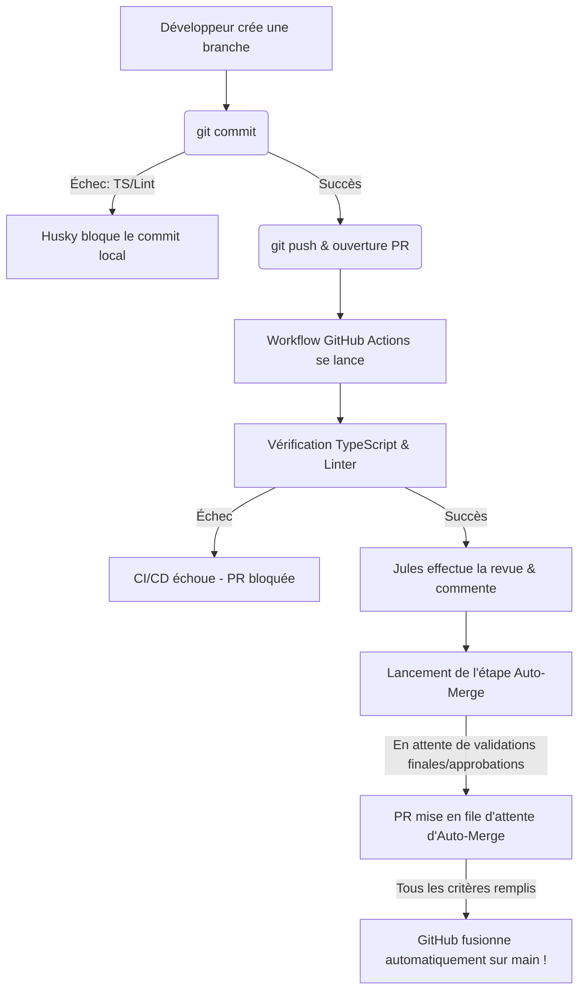

# Guide Technique : Configuration de la Revue et Fusion Automatique (CI/CD + Git Hooks)

Ce guide décrit comment reproduire la configuration de validation locale (Husky), de revue de code automatisée (Jules) et de fusion automatique (Auto-Merge) pour n'importe quel autre dépôt Git/GitHub.

---

## 📋 Table des Matières
1. [Prérequis côté GitHub](#1-prérequis-côté-github)
2. [Étape 1 : Installation et configuration de Husky (Local)](#étape-1--installation-et-configuration-de-husky-local)
3. [Étape 2 : Configuration du Workflow GitHub Actions (CI/CD)](#étape-2--configuration-du-workflow-github-actions-cicd)
4. [Étape 3 : Sécurisation et Branchement (Branche Protection)](#étape-3--sécurisation-et-branchement-branche-protection)
5. [Résumé du flux d'exécution](#résumé-du-flux-dexécution)

---

## 1. Prérequis côté GitHub

Pour que la fusion automatique et les actions fonctionnent, le dépôt distant doit être configuré :

### A. Activer l'Auto-Merge dans les paramètres du dépôt
1. Allez sur votre dépôt GitHub.
2. Cliquez sur l'onglet **Settings** (Paramètres) > **General**.
3. Faites défiler jusqu'à la section **Pull Requests**.
4. Cochez la case **Allow auto-merge** (Autoriser la fusion automatique).

> [!TIP]
> Vous pouvez vérifier si l'option est active en ligne de commande avec le CLI GitHub (`gh`) :
> ```bash
> GH_TOKEN=votre_token_pat gh api repos/PROPRIÉTAIRE/DÉPÔT --jq '.allow_auto_merge'
> ```

### B. Configurer les Secrets du dépôt
1. Allez dans **Settings** > **Secrets and variables** > **Actions**.
2. Cliquez sur **New repository secret**.
3. Ajoutez le secret suivant :
   * **Nom** : `JULES_API_KEY`
   * **Valeur** : Votre clé d'API Jules (obtenue sur [jules.google.com](https://jules.google.com)).

---

## Étape 1 : Installation et configuration de Husky (Local)

Husky permet de bloquer localement les commits contenant des erreurs ou des avertissements de formatage avant même qu'ils ne soient poussés sur GitHub.

### A. Installer Husky et configurer le script de préparation
Dans le répertoire de votre projet, exécutez séquentiellement :

```bash
npm install --save-dev husky
npx husky init
```

### B. Mettre à jour le hook de pré-commit
Le fichier `.husky/pre-commit` est créé par défaut. Modifiez-le pour y inclure la vérification TypeScript et le Linter (ESLint) :

```bash
#!/bin/sh
. "$(dirname "$0")/_/husky.sh"

npx tsc --noEmit && npx eslint .
```

*Désormais, tout `git commit` échouera localement si le compilateur ou le linter détecte une anomalie.*

---

## Étape 2 : Configuration du Workflow GitHub Actions (CI/CD)

Créez le fichier de configuration de l'intégration continue sous `.github/workflows/pr-review.yml`.

Ce fichier configure :
1. La compilation de vérification TypeScript.
2. Le passage du linter ESLint.
3. La revue automatique par Jules avec injection de règles personnalisées.
4. L'appel de fusion automatique `gh pr merge --auto`.

```yaml
name: Jules PR Review

on:
  pull_request:
    types: [opened, synchronize, reopened, ready_for_review]

concurrency:
  group: jules-review-${{ github.event.pull_request.number }}
  cancel-in-progress: true

permissions:
  pull-requests: write
  contents: write
  statuses: write

jobs:
  review:
    name: Validate and Review
    runs-on: ubuntu-latest
    steps:
      - name: Checkout Repository
        uses: actions/checkout@v4

      - name: Set up Node.js
        uses: actions/setup-node@v4
        with:
          node-version: 20
          cache: 'npm'

      - name: Install Dependencies
        run: npm ci

      - name: TypeScript Compilation Check
        run: npx tsc --noEmit

      - name: ESLint Quality Check
        run: npx eslint .

      - name: Jules PR Reviewer
        uses: sanjay3290/jules-pr-reviewer@v1
        with:
          jules_api_key: ${{ secrets.JULES_API_KEY }}
          github_token: ${{ secrets.GITHUB_TOKEN }}
          rules_file: .agent/rules/GCC.md # Optionnel : Fichier contenant vos règles de développement
          extra_instructions: |
            Tu es Jules, l'agent IA officiel de revue de code de ce projet.
            Lorsque tu laisses un commentaire ou une revue de code sur une Pull Request, commence impérativement tes messages en te présentant clairement comme Jules (ex: "Bonjour, ici Jules !", "Jules à l'appareil :" ou en signant par "— Jules" à la fin).
            S'il te plaît, analyse les modifications apportées en appliquant et en vérifiant le respect strict du protocole de règles fourni.

      - name: Enable Auto-Merge
        if: github.event.pull_request.draft == false
        env:
          PR_URL: ${{ github.event.pull_request.html_url }}
          GITHUB_TOKEN: ${{ secrets.GITHUB_TOKEN }}
        run: |
          gh pr merge --auto --merge "$PR_URL" || echo "L'auto-merge n'a pas pu être configuré automatiquement."
```

---

## Étape 3 : Sécurisation et Branchement (Branche Protection)

Pour forcer les pull requests à passer les tests de validation de la CI/CD avant d'être fusionnées, configurez une règle de protection de branche :

1. Allez dans **Settings** > **Branches**.
2. Cliquez sur **Add rule** (ou éditez la règle pour `main`).
3. Cochez les options suivantes :
   * **Require status checks to pass before merging** (Exiger la réussite des vérifications d'état avant la fusion).
   * Recherchez et ajoutez la tâche de validation : `Validate and Review` (qui correspond au nom défini dans notre workflow de job).
   * Optionnel : **Require a pull request before merging** si vous souhaitez forcer un avis humain ou l'avis approuvé de Jules.

---

## Résumé du flux d'exécution


